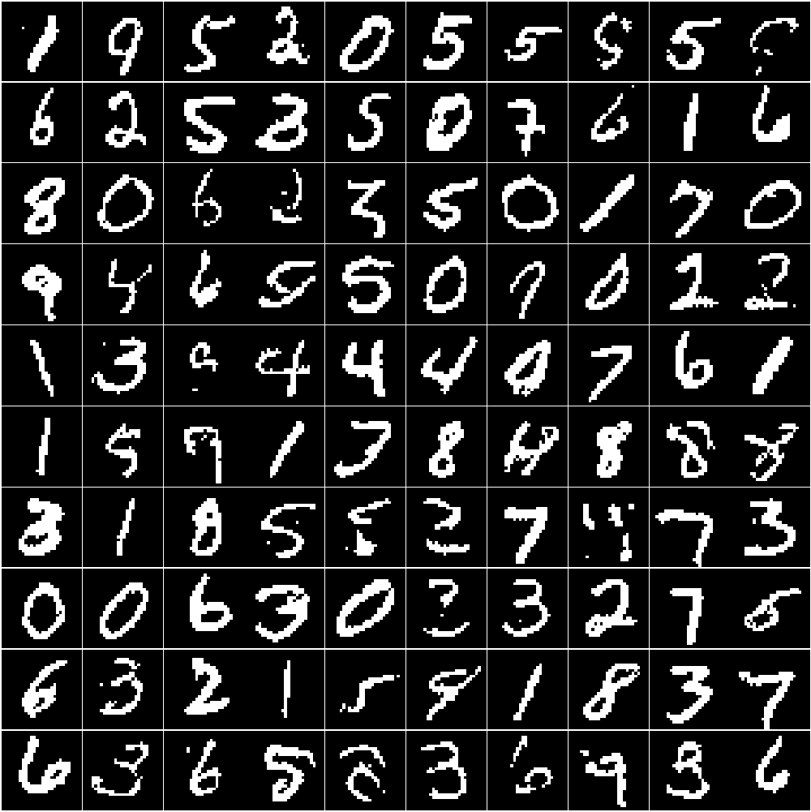

# Masked Autoencoder for Distribution Estimation

This project is a **PyTorch implementation of the paper _“Masked Autoencoder for Distribution Estimation”_ (Germain et al., ICML 2015)**.

The objective was to reproduce the core ideas of MADE on **binarized MNIST**, with particular emphasis on:
- correctness of the autoregressive masking,
- faithful implementation of the Bernoulli likelihood,
- and hyperparameters as close as possible to those reported in the paper.

### Sample generations

Below are samples generated via pixel-by-pixel sampling after training:

### Notes

This implementation focuses on the **core MADE model** and excludes order-agnostic training, connectivity-agnostic training, and skip connections.
